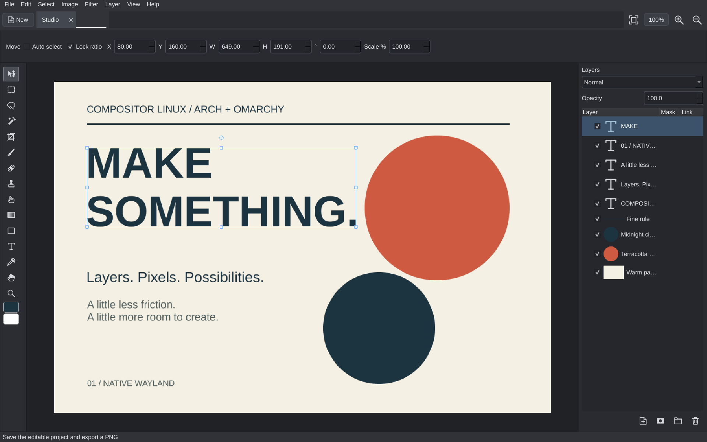
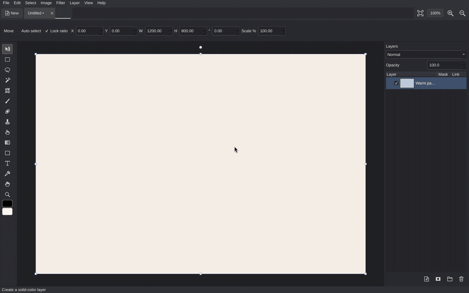
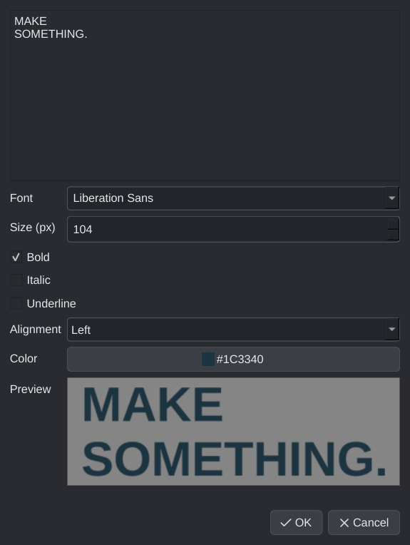
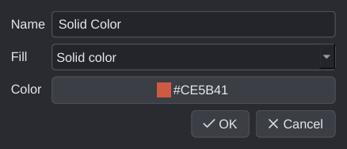

# Compositor Linux

[](https://github.com/dlpwaters/compositor/actions/workflows/linux.yml)

A native layered image editor for **Arch Linux and Omarchy**, built with Qt and
Wayland. Compose images, paint and retouch, edit text, work with masks and
adjustment layers, and keep the editable project alongside your exports.

This fork ports [Compositor](https://github.com/robbietilton/Compositor), created
by **Robbie Tilton / Wonder Assembly LLC**. It reuses the original eight C pixel
kernels and preserves the macOS sources. The Linux interface, packaging, and
editable text support are maintained in this fork. This is an independent port;
it is not an official Omarchy or upstream Compositor release.

**Early release:** the editor works on native Wayland, but exact Mac rendering
and interaction parity are still being qualified. Rendering uses the CPU, and
local background removal uses U2NETP rather than Apple Vision. See the
[feature and parity audit](docs/linux-parity.md) for specific limits.

[Download the 0.1.1 preview](https://github.com/dlpwaters/compositor/releases/tag/linux-v0.1.1)
or follow the source installer below. **Arch/Omarchy x86_64 is the tested target.**
The per-user installer is the recommended way to try this build.



### See the editor in action

[](docs/media/compositor-linux-demo.mp4)

[Watch / download the full desktop demo](docs/media/compositor-linux-demo.mp4).
Recorded from the native Wayland application on **Omarchy workspace 5**:
create a solid-color layer, add and edit text, undo, recolor the background,
save the editable project, and export a PNG. The reproducible demo uses native
Qt controls and Qt test events; its sample artwork is loaded between steps.
Screenshots and footage show synthetic artwork only.

[Open the editable sample](docs/examples/Studio.comp) to try the same design.
It is included in a normal clone and in the release's sample archive. The fonts
use Liberation Sans, supplied by the installer; all source pixels are embedded.

## Install on Arch / Omarchy

Use an ordinary user account in a graphical Linux desktop session. You need
internet access for the first install, Python **3.11 or newer**, a C compiler,
and a working Wayland or X11 desktop. Omarchy does not need extra window rules,
services, or global shortcuts. Keep your Arch system current through your usual
update process before installing; the installer does not upgrade the system.

### Recommended: per-user source installer

Install `git` with your package manager if it is not already available, then:

```sh
git clone --branch linux-v0.1.1 https://github.com/dlpwaters/compositor.git
cd compositor
./install.sh --install-system-deps
~/.local/bin/compositor-linux
```

Choose **Compositor Linux** in Omarchy's application launcher after installation.
If `~/.local/bin` is on your shell's PATH, `compositor-linux` also works directly.
The script can be run from any working directory; `scripts/linux-install.sh`
is the equivalent entry point.

The installer checks the prerequisites, creates `linux/.venv`, downloads the
Python dependencies, compiles the original C pixel kernels, and checks text,
SVG icons, saved projects, and PNG export before installing desktop launchers.
It refuses to run as root. `--install-system-deps` prints missing Arch packages
and requests graphical administrator authorization through **pkexec** for just
those packages. It uses `pacman -S --needed`; it does not refresh databases,
upgrade the system, or silently accept pacman's confirmation prompt.

If graphical authorization is unavailable, install the prerequisites through
your usual administrator/package-manager workflow and run `./install.sh`.
Canceling authorization stops installation before the Python environment is set up.

| Prerequisite | Purpose |
| --- | --- |
| `base-devel`, `python` | Build the original C kernels and run the editor |
| [`uv`](https://archlinux.org/packages/extra/x86_64/uv/) | Install isolated Python dependencies; an existing user installation is accepted |
| [`qt6-wayland`](https://archlinux.org/packages/extra/x86_64/qt6-wayland/), `qt6-svg` | Qt platform libraries, Wayland support and SVG support; dependencies include the X11 libraries |
| `desktop-file-utils` | Validate and register the desktop launcher |
| `ttf-liberation` | Reliable default fonts and the included sample's typefaces |

For a manual dependency installation, the same list is:

```text
base-devel python uv qt6-wayland qt6-svg desktop-file-utils ttf-liberation
```

No AUR helper or downloaded root script is required. Python packages live in
the checkout's virtual environment, separately from Arch's system Python packages.
Do not move or delete that checkout while its launchers are in use.

### Installer options and optional background removal

```sh
./install.sh --check                  # Read-only prerequisite check
./install.sh                         # Install or update using existing prerequisites
./install.sh --install-system-deps    # Offer missing Arch packages for authorization
./install.sh --install-model          # Also download the optional background-removal model
./install.sh --without-background     # Install the editor without ONNX Runtime
./install.sh --help
```

The default install includes ONNX Runtime, but **does not download a model**.
Background removal runs locally. Add the pinned, checksummed **4.6 MB U2NETP**
model later with:

```sh
linux/.venv/bin/compositor-install-model
```

The default model lives under `$XDG_DATA_HOME/compositor/models/`, normally
`~/.local/share/compositor/models/`. Existing different model files are preserved.
The editor works without the model; Remove Background can also accept a compatible
local ONNX file. A compatible CPU runtime is required for that feature.

### Installation locations, upgrades and removal

| Location | Contents |
| --- | --- |
| `<checkout>/linux/.venv/` | Python interpreter environment, dependencies and executable |
| `~/.local/bin/compositor-linux` | Primary command pointing to that checkout |
| `~/.local/bin/compositor` | Compatibility alias, created only when available or already owned |
| `$XDG_DATA_HOME/applications/compositor.desktop` | Compositor Linux application launcher |
| `$XDG_DATA_HOME/icons/hicolor/256x256/apps/compositor.png` | Application icon |
| `$XDG_DATA_HOME/compositor/models/` | Optional, separately downloaded model |

`XDG_DATA_HOME` defaults to `~/.local/share`. The installer preserves unrelated
commands and refuses to overwrite a conflicting primary launcher, desktop file,
or icon. Preferences use Qt's normal user settings location. Projects are saved
where you choose, independently of the environment and launchers.

To move from a tagged preview to ongoing development updates, close the editor,
preserve any local changes, then:

```sh
git fetch origin
git switch main
git pull --ff-only
./install.sh
```

For another tagged preview, fetch tags and switch to the desired release instead
of `main`. Rerunning the installer updates dependencies and rebuilds kernels.
After an Arch Python major/minor upgrade, the installer detects an incompatible
environment. Keep it as a backup and create a fresh one:

```sh
mv linux/.venv linux/.venv.backup
./install.sh
```

Choose a different backup name if that directory already exists. Projects,
preferences, and models are outside the environment and stay in place.
After moving a checkout, rerun the installer; if its virtual environment no longer
works, rebuild it the same way.

To remove only this install's launchers:

```sh
./install.sh --remove
```

Removal keeps projects, settings, models, the checkout, and its Python environment.
After removing the launchers you can delete the checkout yourself if you no longer
need it. System prerequisite packages are left to your package manager.

### Alternative: Arch package

The [PKGBUILD](packaging/arch/PKGBUILD) builds a system package from a local source
archive. This path is for Arch packagers; use the per-user installer above for
the qualified installation path. Install its declared build/check dependencies,
including `base-devel`, `python-build`, `python-installer`, `python-setuptools`,
`python-wheel`, `python-pytest` and `desktop-file-utils`, then:

```sh
COMPOSITOR_PYTHON=/usr/bin/python scripts/arch-package.sh --syncdeps
```

`makepkg` resolves runtime dependencies with your configured package-manager
authorization. Review the resulting package before installing it with pacman.
The recipe lists its optional background-removal runtime separately. x86_64
package creation has been exercised; a clean system package installation and
aarch64 remain unqualified. There is no AUR package maintained by this fork.
Avoid installing both the per-user and system-package launchers at the same time.

## What you can make

- **Layers:** folders, nesting, blend modes, opacity, raster and folder masks,
  clipping masks, duplicate/reorder/merge, and multiple project tabs.
- **Text:** press **T**, click the canvas, and choose text, font, size, styles,
  alignment, and color. Double-click the text layer or use **Edit Layer Content**
  to edit it again. Previews commit as one undo step.
- **Color layers:** the layer **+** button or **Ctrl+Shift+N** offers transparent
  or solid-color fill. Double-click a solid layer to change its color.
- **Transform and select:** move, scale, rotate, flip, distort, crop, snapping,
  marquee, lasso, wand, and selection refinement.
- **Paint and retouch:** brush, eraser, healing, clone, blur, liquify/smudge,
  gradients, shapes, and eyedropper. Tools use scalable monochrome SVG icons.
- **Adjust and export:** six editable adjustment types, filters, optional local
  background removal, JPEG/PNG/HEIC/TIFF import, PNG/JPEG export, and clipboard.

| Editable text | Solid-color layers |
| --- | --- |
|  |  |

View the full native workflows: [text on the canvas](docs/screenshots/text-workflow.png)
and [the solid-color layer chooser](docs/screenshots/solid-workflow.png).

## Your first composition

1. Choose **File → New Canvas** (**Ctrl+N**) and enter a width and height, or
   **File → Import Images** (**Ctrl+Shift+O**) to start with your own image.
2. Click **+** at the bottom of the Layers panel (**Ctrl+Shift+N**). Name the
   layer and choose **Solid color** for a background, or **Transparent** to paint.
3. Press **T** and click the canvas. Enter multiline text, choose the font, pixel
   size, styles, alignment and color, then accept the preview. Double-click its
   layer later to edit it again.
4. Press **V** to move a selected layer. Use **Ctrl+T** to transform it; choose
   Apply/Enter or Cancel/Escape. Select the intended layer or mask in the right panel
   before painting or adjusting it. Visibility checkboxes hide layers temporarily.
5. Save with **Ctrl+S** to keep editable layers in a `.comp` project directory.
   Export a finished PNG with **Ctrl+Shift+E**, or JPEG with **Ctrl+Alt+Shift+S**.
   Exporting an image does not replace saving the project.

To explore the included poster, open it from the checkout:

```sh
~/.local/bin/compositor-linux docs/examples/Studio.comp
```

Use **Save As** before changing the sample. The [full editing and shortcut guide](linux/README.md#editing-and-shortcuts)
covers selections, clone sources, brush modifiers, masks, clipping and adjustments.
Tooltips show tool names and shortcuts. Menus remain available when the window
manager intercepts a key combination.

## Following upstream updates

This fork tracks the original Mac project through a daily release report and
weekly Linux CI. The report identifies shared kernel changes, project-format
changes, and features that need Python/Qt porting. Updates go through review;
monitoring does not change the installed editor. See the
[maintenance guide](docs/upstream-maintenance.md) and the
[daily Hermes prompt](docs/hermes-daily-prompt.md).

## Projects and compatibility

`.comp` projects are directories containing a manifest and embedded PNG assets.
Transfer the whole directory. The Linux editor reads versions 1–7 and writes
version 7; imported photo paths are not needed to reopen a saved project.

Text is a Linux extension stored with a PNG fallback. Other readers can display
the baked pixels; saving in the original Mac app can drop text editability.
Pixel edits rasterize text, and Undo restores it. Reopening a project preserves
its saved appearance even when the original font is unavailable; editing text
requires that font or uses Qt's fallback. Real Mac round-trip validation remains
pending. Details are in the [project format reference](docs/project-format.md).

The current canvas-side limit is 30,000 pixels, with 100-megapixel raster budgets.
Undo keeps up to 64 steps and approximately 512 MiB of unique raster assets.
CPU rendering can become slow on large photos before reaching these limits.
Project replacement requires Linux atomic directory exchange; unsupported filesystems
fail the save while retaining the existing project.

## Troubleshooting

| Symptom | What to check |
| --- | --- |
| A prerequisite is missing | Run `./install.sh --check`; install the listed packages manually or use `--install-system-deps`. |
| Graphical authorization does not appear | A running polkit authentication agent and `pkexec` are required for the optional package step. Install packages through your desktop's usual administrator workflow, then rerun without that flag. |
| Pacman cannot find/download a package | Update Arch using your normal full system update process, then retry. Avoid a standalone database refresh followed by a partial upgrade. |
| Command is not found | Use `~/.local/bin/compositor-linux`, or the application launcher. Add `~/.local/bin` to your shell's PATH through your normal shell configuration. |
| Launcher opens an old or moved install | Remove the old install's launchers, then rerun the installer in the checkout you want to use. |
| Python or native kernels fail after an update | Rename `linux/.venv` as a backup and rerun the installer; keep the backup until the new install works. |
| Qt cannot connect to the display | Launch from your desktop session, not a headless SSH session. Confirm the Qt prerequisites. For diagnosis on Wayland try `QT_QPA_PLATFORM=wayland QT_QPA_PLATFORMTHEME= ~/.local/bin/compositor-linux`. |
| A font looks different | Install the font used by the document. Saved text keeps its original bitmap; editing uses an available font or fallback. |
| Remove Background is unavailable | Use the default install (with ONNX Runtime), then explicitly install the model. Model download is not automatic. |
| A shortcut does nothing | Try the equivalent menu action; the desktop may own that key combination. |

For a finite renderer check without a display:

```sh
linux/.venv/bin/python scripts/linux-check.py --background
```

Omit `--background` if you deliberately installed without ONNX Runtime.
For bugs, include the app version (`~/.local/bin/compositor-linux --version`),
OS, Python version, session type, the failing steps and terminal error message in
[an issue](https://github.com/dlpwaters/compositor/issues). Use a synthetic reproduction
when possible. Report security problems privately through [SECURITY.md](SECURITY.md).

## Local processing and security

Image processing stays on the machine. There is no cloud upload, telemetry,
account requirement, or automatic model download. The optional model installer
checks a pinned size and SHA-256. Source installation accesses package servers;
the optional model download accesses GitHub.

The project reader validates paths, types, dimensions, hierarchy, and asset
budgets. Saves stage and atomically replace a project; text is rendered as plain
text. These protections and their tests are described in
[SECURITY.md](SECURITY.md). This is an early release, not an independent security
certification. Keep dependencies updated and back up original projects.

## Build and verify

```sh
uv venv linux/.venv
uv pip install --python linux/.venv/bin/python -e '.[test,background]' build
linux/.venv/bin/ruff check linux scripts/linux-*.py setup.py
linux/.venv/bin/ruff format --check linux scripts/linux-*.py setup.py
QT_QPA_PLATFORM=offscreen QT_QPA_PLATFORMTHEME= linux/.venv/bin/python -m pytest -q
linux/.venv/bin/python -m build
desktop-file-validate packaging/linux/compositor.desktop
```

Linux CI tests Python 3.12 and 3.14, builds wheel/source distributions, and
installs/reinstalls/removes the source build as an ordinary user in a fresh Arch
container. The container qualifies dependency resolution and headless rendering;
native Wayland editing is separately exercised on this Omarchy machine. It does
not establish a second machine's GPU, polkit agent, or physical shortcut behavior.

Reproduce the synthetic demo locally with:

```sh
QT_QPA_PLATFORM=wayland QT_QPA_PLATFORMTHEME= linux/.venv/bin/python scripts/linux-demo.py /tmp/compositor-demo
```

Choose a new output directory each time. It writes an editable sample, exports,
screenshots and a finite verification report, using isolated demo preferences.
It does not start a screen recorder or alter desktop configuration.
[Current validation and outstanding work](docs/STATUS.md) includes native Wayland
checks. macOS development remains in `Compositor.xcodeproj`; consult the
[original project](https://github.com/robbietilton/Compositor) for Mac instructions.

## Credit and licensing

Compositor Linux and the original Compositor sources are **MIT licensed**.
The original `Copyright (c) 2026 Wonder Assembly LLC` notice and full permission
notice are retained in [LICENSE](LICENSE), including in wheel, source, and Arch
packages. Preserve that notice when redistributing the source or substantial
portions of it. The upstream artwork and C kernels retain their attribution.

Dependencies keep their own licenses. Qt/PySide6 are dynamically loaded and
installed separately; they are not relicensed under MIT. Model weights are
downloaded separately. See [third-party notices](THIRD_PARTY_NOTICES.md) for
sources and licensing references. All screenshots show a synthetic project
created for this Linux build.
